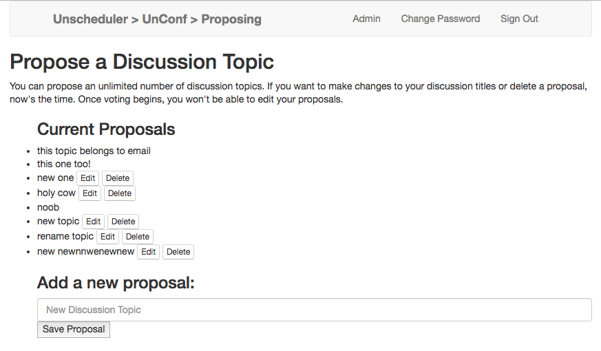
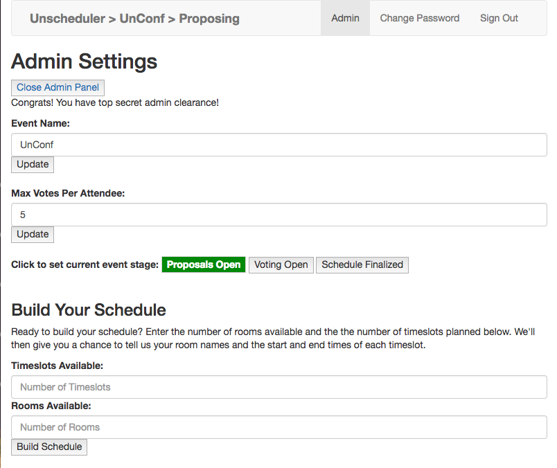
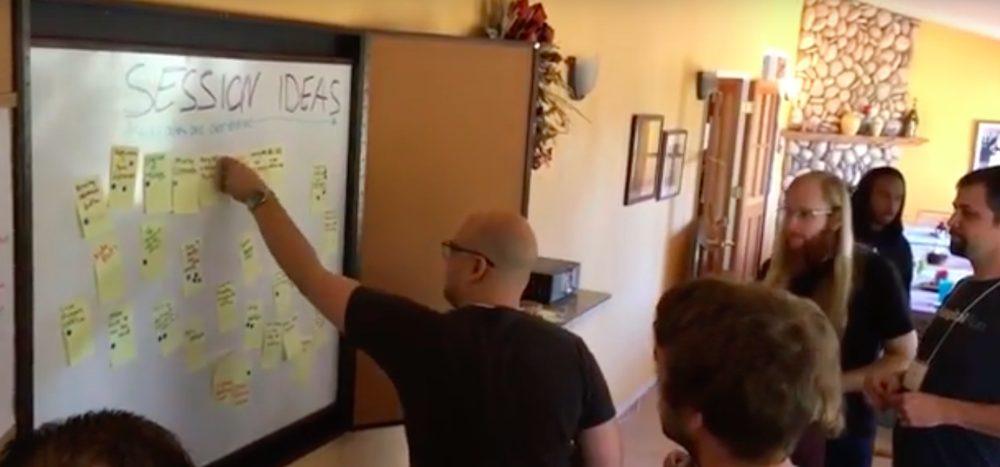
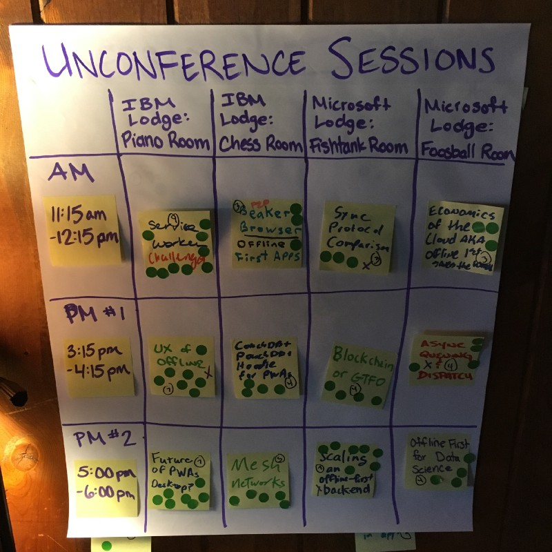

# Unscheduler: An unconference scheduling tool

The Unscheduler is an app for managing the voting and scheduling process for
unconferences, inspired by my work as a co-organizer for [Offline Camp](http://offlinefirst.org/camp). *(Yes, [unconferences have schedules](https://medium.com/offline-camp/crafting-community-events-that-leave-them-wanting-smore-902974cff4d4)!)*

**Check out the code or the [live app](https://terichadbourne.com/unscheduler-ember/)!**

* Front-end client
   * [GitHub repo](https://github.com/terichadbourne/unscheduler-ember) (unscheduler-ember)
   * [Live site](https://terichadbourne.com/unscheduler-ember/) (deployed on GitHub Pages)
* Back-end API
   * [GitHub repo](https://github.com/terichadbourne/unscheduler-backend) (unscheduler-backend)
   * [Live site](https://sleepy-springs-55525.herokuapp.com/) (deployed on Heroku)

## Technologies used

#### Front-End Technologies
- Ember
- Handlebars
- JavaScript
- jQuery
- Bootstrap
- HTML5
- CSS3
- Sass

#### Back-End Technologies
- Ruby on Rails
- PostgreSQL
- Active Record

## Screenshots

#### Discussion Proposals

#### Admin Panel

## The backstory: Unconference organizing with sticky notes and Mr. Sketch markers

As a member of the [Offline First](http://offlinefirst.org) development
community, I co-organize an unconference called [Offline Camp](http://offlinefirst.org/camp), where attendees propose topics for
discussion and then vote to determine what topics are actually discussed in the
limited time we have available. As organizers, we take the votes (a sticky note
for each proposal, with stickers representing votes won) and give some careful
thought to how to best schedule the winning sessions so that the most popular
ones are spread across different timeslots from each other and in the largest
available rooms, topics that should appeal to similar subgroups of attendees
aren't scheduled to conflict with one another, etc.

Check out these photos for a taste of the current analog process:

#### Voting on proposed discussion topics with sticky notes and stickers

#### Scheduling the winners on a grid of available session slots

## Project planning and strategy

Preparation and planning were key to my success with this project. Here's a look
at my strategy and process.

For my first experience with Ember, I decided to return to the Unscheduler app
that I had previously built in jQuery and work on some new functionality. Since
event admins make decisions that affect what all users see when they visit the
site (proposals, voting, or final schedule), this seemed like a natural use case
for view states. With only 4 days available to update my Ruby on Rails API and
rework the front end, prioritization was key.

### Features

Here's a look at the current and future features of the Unschedulur app. Many actions are restricted to admin users.

Feature | User Access | Completion Status
--- | --- | ---
Set event name and max votes per person | <ul><li>[x] Organizers</li><li>[ ] Participants</li></ul> |<ul><li>[x] jQuery</li><li>[x] Ember</li></ul>
Set event status (proposing, voting, schedule final) | <ul><li>[x] Organizers</li><li>[x] Participants</li></ul> | <ul><li>[x] jQuery</li><li>[x] Ember</li></ul>
Propose discussion topics | <ul><li>[x] Organizers</li><li>[x] Participants</li></ul>|<ul><li>[x] jQuery</li><li>[x] Ember</li></ul>
Vote on discussion topics  | <ul><li>[x] Organizers</li><li>[x] Participants</li></ul>|<ul><li>[x] jQuery</li><li>[ ] Ember</li></ul>
Calculate winning sessions  | <ul><li>[x] Organizers</li><li>[ ] Participants</li></ul> |<ul><li>[x] jQuery</li><li>[ ] Ember</li></ul>
Build placeholder schedule with rooms and timeslots  | <ul><li>[x] Organizers</li><li>[ ] Participants</li></ul> |<ul><li>[ ] jQuery</li><li>[x] Ember</li></ul>
Assign discussion topics to session slots | <ul><li>[x] Organizers</li><li>[ ] Participants</li></ul> |<ul><li>[ ] jQuery</li><li>[ ] Ember</li></ul>
View final schedule (beta - timeslots only)| <ul><li>[x] Organizers</li><li>[x] Participants</li></ul> |<ul><li>[ ] jQuery</li><li>[x] Ember</li></ul>
View final schedule (improved formatting with discussions assigned)| <ul><li>[x] Organizers</li><li>[x] Participants</li></ul> |<ul><li>[ ] jQuery</li><li>[ ] Ember</li></ul>

_Curious to see the previous implementation of this app? You can find more info [here](https://github.com/terichadbourne/unscheduler-client)._

### User Stories

These user stories guided my development process for both versions of the project:

- **Proposing**
   - As an event attendee or organizer, I want to see a list of all currently proposed sessions so that I don't create a duplicate proposal.
   - As an event attendee or organizer, after seeing other proposals, I then want to propose a new unconference session topic for everyone to vote on so that my favorite topic will be covered.

- **Voting**
   - As an event organizer, I want control how many votes each attendee is allowed.
   - As an event attendee or organizer, I want to see a list of all proposed sessions so that I can choose how to use my X number of votes.
   - As an event attendee or organizer, I want to apply my X number of votes to my favorite sessions (either all to one or one/some to multiple) so that my favorite topics are likely to be selected.

- **Scheduling**
   - As an event organizer, I want to view all proposed sessions ordered by vote count to determine which are the winners.
   - As an event organizer, I want to add some keywords (such as UX) to winning sessions to help guide my timeslot assignments, ensuring similar sessions aren't scheduled on top of each other.
   - As an event organizer, I want to add a list of daily timeslots avialable for sessions to create my base schedule.
   - As an event organizer, I want to add a list of rooms available for discussion sessions to create my base schedule.
   - As an event organizer, I want to assign each winning session to an available timeslot and room so attendees can see their options.
   - As an event attendee or organizer, I want to see today's sessions by time, with room indicated for each so I know where to be when.

### Wireframes

These wireframes guided my front-end development for the Ember client:

- [Wireframe: Proposing Topics](https://www.dropbox.com/s/ilzjq21ivk9fux2/Wireframe_1_Proposing.JPG?dl=0)
- [Wireframe: Admin Panel](https://www.dropbox.com/s/1kuw85esjv0h5p5/Wireframe_4_Admin_Assorted.JPG?dl=0)
- [Wireframe: Final Schedule](https://www.dropbox.com/s/jio0qevf7ddwjak/Wireframe_3_Schedule.JPG?dl=0)
- [Wireframe: Voting](https://www.dropbox.com/s/xe6uwt8r28fxd27/Wireframe_2_Voting.JPG?dl=0)
- [Wireframe: Admin Session Scheduling](https://www.dropbox.com/s/whapg3cirhbfz1m/Wireframe_5_Admin_Scheduling.JPG?dl=0) (future enhancement: add discussions to timeslots with drag and drop)
- [Wireframe: Final Schedule](https://www.dropbox.com/s/jio0qevf7ddwjak/Wireframe_3_Schedule.JPG?dl=0)

### Entity Relationship Diagrams

I created the following entity relationship diagrams to map out my relational database structure before revising my API, and adjusted the plan to meet time constraints on the project.

- [Entity Relationship Diagrams](https://www.dropbox.com/s/x9k7nurwohfvpw4/ERD.JPG?dl=0)
- [CRUD Actions by Resource](https://www.dropbox.com/s/4hnei17ui9de6nw/CRUD.JPG?dl=0)

### API Routes

My API follows RESTful conventions with resources as follows:

##### Authentication

| Verb   | URI Pattern            | Controller#Action |
|--------|------------------------|-------------------|
| POST   | `/sign-up`             | `users#signup`    |
| POST   | `/sign-in`             | `users#signin`    |
| PATCH  | `/change-password`     | `users#changepw`  |
| DELETE | `/sign-out`            | `users#signout`   |

##### Users

| Verb | URI Pattern | Controller#Action |
|------|-------------|-------------------|
| GET  | `/users`    | `users#index`     |
| GET  | `/users/1`  | `users#show`      |
| PATCH| `/users/1`  | `users#update`    |

##### Discussions

| Verb | URI Pattern | Controller#Action |
|------|-------------|-------------------|
| GET  | `/discussions`    | `discussions#index`     |
| GET  | `/discussions/1`  | `discussions#show`      |
| POST   | `/discussions`   | `discussions#create`    |
| PATCH| `/discussions/1`  | `discussions#update`    |
| DELETE | `/discussions`   | `discussions#destroy`   |

##### Votes

| Verb | URI Pattern | Controller#Action |
|------|-------------|-------------------|
| GET  | `/votes`    | `votes#index`     |
| GET  | `/votes/1`  | `votes#show`      |
| POST   | `/votes`   | `votes#create`    |
| DELETE | `/votes`   | `votes#destroy`   |

##### Timeslots

| Verb | URI Pattern | Controller#Action |
|------|-------------|-------------------|
| GET  | `/timeslots`    | `timeslots#index`     |
| GET  | `/timeslots/1`  | `timeslots#show`      |
| POST s | `/timeslots`   | `timeslots#create`    |
| PATCH | `/timeslots/1`  | `timeslots#update`    |
| DELETE | `/timeslots`   | `timeslots#destroy`   |

##### Events

| Verb | URI Pattern | Controller#Action |
|------|-------------|-------------------|
| GET  | `/events`    | `events#index`     |
| GET  | `/events/1`  | `events#show`      |
| PATCH| `/events/1`  | `events#update`    |

### Work Process

I took a methodical approach to development of the app, first building out each
PostgreSQL table and getting my Rails server up and running via curl scripts before
adding the related front-end functionality. Here's a look at my work plan.

**Setup**
* Copy my old Rails app and deploy on a new Heroku server so I can add functionality without breaking the first version
* Create a brand new Ember app from the template and deploy to GH pages after re-naming everything properly

**MVP**
* Pick Option A or B for new scheduling functionality with advice from instructors
* API: Test old resources through curl scripts
* API: Add "timeslots" resource, adjust other resources as needed, and test with curl scripts
* API (IF USING OPTION B): Add "assignments" join table, adjust other resources as needed, and test with curl scripts
* Client: Re-implement scheduling, voting, and existing admin functions in Ember
* Client: Implement admin confirming winning sessions, updating records as needed based on Option A or Option B
* Client: Implement assigning winning sessions to timeslots (with drag-and-drop if I'm getting it easily, otherwise switch to simpler solution and come back to this)
* Style, debug, deploy

**Stretch Goal # 1: Drag and Drop**
* Client: Circle back to drag-and-drop if not completed already
* Style, debug, deploy

**Stretch Goal #2: Room Capacities**
* API: Add room capacities to timeslot records, update and test with curl scripts
* Client: Display both room capacities and vote counts during assignment process
* Style, debug, deploy

**Stretch Goal #3: Display Names**
* API: Add display names to user records, update and test with curl scripts
* Client: Display friendly username in nav and potentially on discussion listings
* Style, debug, deploy

- [Options A & B and stretch goals](https://www.dropbox.com/s/g9yzcoqiul4omjq/Plans_and_Stretch_Goals.JPG?dl=0)

### Installation

**To run the client app locally: **
- Fork and clone the [client repository](https://github.com/terichadbourne/unscheduler-ember).
- Install build dependencies with `npm install`. Dependencies are stored in `package.json`. (If you have not installed phantomjs, you will need to install it globally: `npm install --global phantomjs-prebuilt`.)
- Commit your changes.
- Run the development server with `ember server`.
- Open in your browser at [http://localhost:7165/](http://localhost:7165/).

**To serve the back end locally: **
- Fork and clone the [back-end repository](https://github.com/terichadbourne/unscheduler-backend).
- Install dependencies with `bundle install`.
- Commit your changes.
- Create a .env for sensitive settings (`touch .env`).
- Generate new development and test secrets (`bundle exec rails secret`) and
store them in `.env` with keys `SECRET_KEY_BASE_DEVELOPMENT` and `SECRET_KEY_BASE_TEST`.
- Run the local API server at `http://localhost:4741/events` with `bin/rails server` or `bundle exec rails server`.
